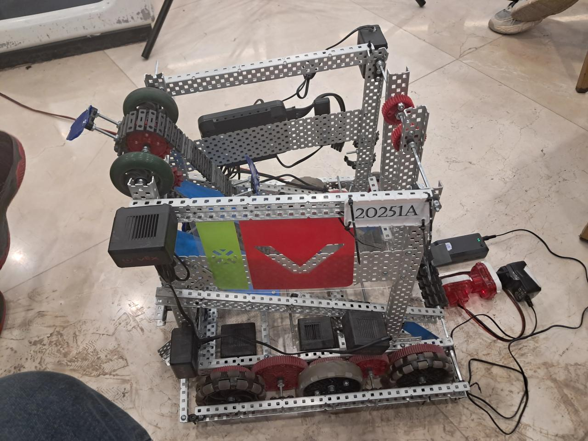

# Team 5Kbot (20251A) — VEX V5 High Stakes Robot

Team 5Kbot designed, built, wired, programmed, and tested this competition robot for the 2024–2025 VEX Robotics Competition **High Stakes** season. Working with supplied VEX V5 kit components—structural parts, motors, brain, controller, and the development platform—rather than a finished robot, we developed our own mechanical layout, mechanisms, electrical integration, and competition strategy from the ground up.

<p align="center">
  
</p>

## Competition result

At the March 2025 African Championship, Team 5Kbot earned:

- **Tournament Champion**
- **Robot Skills Champion**
- **Excellence Award**

The result reflected the complete system: a reliable physical robot, repeatable autonomous behavior, responsive driver control, and the team's ability to adapt its strategy during competition.

## Robot and control system

The final robot combined a four-motor drivetrain with independently controlled mechanisms for ring intake, gripping, and arm movement. Its VEX V5 configuration includes:

- four drivetrain motors;
- upper and lower intake motors;
- a dedicated gripping motor;
- a dedicated arm motor; and
- VEXcode Blocks programs developed and iterated against the physical robot.

We treated the kit as a component platform rather than a prescribed build. Mechanical geometry, motor placement, wiring, mechanism integration, and control sequences were revised repeatedly as testing exposed traction, alignment, timing, and reliability problems.

## Autonomous and driver-controlled preparation

VEX competition performance required both autonomous execution and effective manual control, so we developed the two together.

For autonomous play, we built separate routines for red and blue alliance starting positions, with offensive/attack and defensive alternatives where appropriate. The programs coordinate drivetrain movement with the intake, gripper, and arm so the robot can execute repeatable opening sequences without driver input.

For driver-controlled play, we focused on predictable handling, dependable mechanisms, rapid transitions between scoring actions, and operator practice. Repeated testing helped the team tune the robot around real match conditions rather than treating manual control as an afterthought.

The versioned `.v5blocks` files in this repository primarily preserve the autonomous routines; driver-control preparation was part of the complete robot and competition workflow.

## Repository organization

```text
5K-bot/
├── BlueLeft/
│   ├── Attack/
│   └── Defence/
├── BlueRight/
│   └── Offence/
├── RedLeft/
│   ├── Attack/
│   └── Defence/
└── RedRight/
    ├── Attack/
    └── defence/
```

Each directory contains one or more VEXcode Blocks (`.v5blocks`) programs for a particular alliance color, starting position, and strategic role. The repository also includes the VRC High Stakes game manual used during development.

## Opening the programs

1. Install [VEXcode V5](https://www.vexrobotics.com/vexcode/install/v5).
2. Download or clone this repository.
3. Open the required `.v5blocks` file in VEXcode V5.
4. Review the configured drivetrain and mechanism ports before downloading a program to another robot.

Motor directions, dimensions, and sequence timing were tuned for Team 5Kbot's physical build. They should be treated as robot-specific starting points, not universal values for another VEX V5 design.
